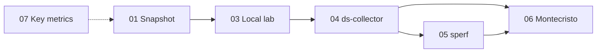

# Cassandra health check training

Hands-on curriculum for technical specialists: understand Cassandra / HCD cluster health from **live signals**, then deepen with **diagnostic collection**, **[sperf](https://github.com/datastax-labs/sperf)** CLI summaries, and **[Montecristo](https://github.com/datastax-labs/Montecristo)** reports.




## Learning path

| # | Guide | Focus |
|---|--------|--------|
| **01** | [Health snapshot — VM / bare metal](docs/01-health-snapshot-bare-metal.md) | `nodetool`, logs, disk, OS — no extra tooling |
| **02** | [Health snapshot — Kubernetes / Mission Control](docs/02-health-snapshot-kubernetes.md) | CRs, pods, MC UI, Mimir/Loki |
| **03** | [Local lab](docs/03-local-lab.md) | Docker `cassandra:5.0` + optional `cassandra-stress` |
| **04** | [Diagnostic collection](docs/04-diagnostic-collection.md) | [ds-collector](https://github.com/datastax/diagnostic-collection) bundles |
| **05** | [sperf analysis](docs/05-sperf-analysis.md) | CLI summaries from collector tarballs (in Docker image) |
| **06** | [Montecristo analysis](docs/06-montecristo-analysis.md) | Containerized [Montecristo](https://github.com/datastax-labs/Montecristo) reports |
| **07** | [Key metrics to track](docs/07-key-metrics.md) | Triage flow, thresholds, nodetool/JMX, Mission Control panels |

## Quick start — analysis container

Prerequisites: Docker, diagnostic `*.tar.gz` from ds-collector.

```bash
./scripts/analyze.sh build
./scripts/analyze.sh run my-ticket-id ./diagnostics
# Hugo: http://localhost:1313/final/
# sperf: ./ds-discovery/my-ticket-id/sperf/

./scripts/analyze.sh sperf my-ticket-id ./diagnostics   # sperf only
```

See [docs/05-sperf-analysis.md](docs/05-sperf-analysis.md) and [docs/06-montecristo-analysis.md](docs/06-montecristo-analysis.md).

## Repository layout

| Path | Purpose |
|------|---------|
| [`docs/`](docs/01-health-snapshot-bare-metal.md) | Training modules 01–07 |
| [`docker/`](docker/Dockerfile) | Analysis image — Montecristo + sperf |
| [`scripts/analyze.sh`](scripts/analyze.sh) | Build and run analysis container |
| [`scripts/lab-stress.sh`](scripts/lab-stress.sh) | `cassandra-stress` on lab container |
| `diagnostics/` | ds-collector `*.tar.gz` bundles (gitignored) |
| `ds-discovery/` | Montecristo / sperf output from `analyze.sh` (gitignored) |

## Lab environment

For a local Mission Control + HCD KinD lab, use [mc-lab](https://github.com/datastax/mc-lab) — especially [observability](https://github.com/datastax/mc-lab/blob/main/docs/05-observability.md) for metrics and logs during module **02**.

## External tools

- [Diagnostic Collector](https://github.com/datastax/diagnostic-collection) — gather support bundles (SSH, Docker, or Kubernetes)
- [sperf](https://github.com/datastax-labs/sperf) — CLI performance analysis ([Docker image only](docs/05-sperf-analysis.md))
- [Montecristo](https://github.com/datastax-labs/Montecristo) — discovery analysis and Hugo report (built into this repo’s Docker image)
