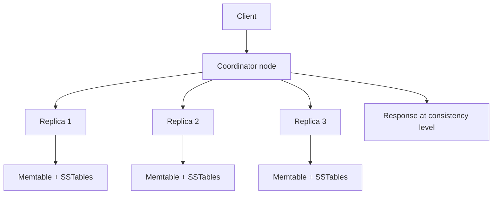
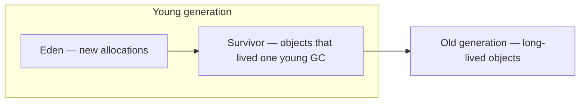

# Troubleshooting — latency to machine resources

A top-down guide for Cassandra / HCD incidents: start at **client latency**, peel back through the **request path and cluster behavior**, and end at **host resources**. Pair this with the metric cheat sheet in [Key metrics](07-key-metrics.md) and live checks from [bare-metal](01-health-snapshot-bare-metal.md) or [Kubernetes / Mission Control](02-health-snapshot-kubernetes.md) snapshots.

**When to use this doc:** p99 climbs while load is flat, timeouts appear under steady traffic, or a few nodes look worse than the rest. The goal is to explain *why* Cassandra produces **outliers** — not just which panel turned red.

---

## How Cassandra turns architecture into outliers

Most “random” latency spikes are not random. They come from how Cassandra distributes work:



| Architecture fact | What users see |
|-------------------|----------------|
| **Coordinator** picks replicas (by partitioner + replication strategy) and merges results | One slow replica can dominate p99 at `QUORUM` / `LOCAL_QUORUM` — the coordinator waits for the slowest required response |
| **Partition key** maps to token ranges on specific nodes | Skewed keys → hot nodes; outliers cluster on a subset of hosts |
| **Reads** touch memtable + bloom-filtered SSTables | More SSTables or tombstones → long tail on reads even when median is fine |
| **Writes** append to memtable, then flush/compaction | Flush or compaction backlog → write latency tail; disk-bound nodes lag peers |
| **No single leader per partition** — replicas are peers | Gossip/marked-down replicas, hints, and repair create *temporary* asymmetry between nodes |
| **JVM + OS page cache** share the node | GC pause or swap on one replica → that replica becomes the “slow one” in the quorum |

**Outlier pattern:** median (p50) stable, **p99/p999 spike** → usually a **tail on a subset of replicas**, **extra disk work**, or **stop-the-world GC** — not always higher average load.

---

## Triage order (symptom → layer)

Work top-down. Confirm each layer before jumping to JVM or kernel tuning.

| Step | Question | If yes, go to |
|------|----------|----------------|
| 1 | Is **latency** up (reads, writes, or both)? | [§1 Client latency](#1-symptom-latency-too-high) |
| 2 | Are **timeouts / unavailables / dropped messages** non-zero? | [§2 Errors and partial failure](#2-errors-and-partial-failure) |
| 3 | Is **backpressure** visible (`tpstats` pending/blocked)? | [§3 Thread pools and backpressure](#3-thread-pools-and-backpressure) |
| 4 | Is **compaction or disk** backlog growing? | [§4 Compaction and storage](#4-compaction-and-storage) |
| 5 | Are **GC pauses** or heap pressure high? | [§5 JVM and GC](#5-jvm-and-gc) |
| 6 | Are nodes **down**, **streaming**, or **hints** backing up? | [§6 Topology, repair, and hints](#6-topology-repair-and-hints) |
| 7 | Is one **table / partition** hot? | [§7 Data model and hot spots](#7-data-model-and-hot-spots) |
| 8 | Is the **host** saturated (CPU, iowait, disk, memory)? | [§8 Machine resources](#8-machine-resources) |

Always correlate latency with **the same time window** on GC, compaction, disk IO, and per-node panels (`$by` in Mission Control).

---

## 1) Symptom: latency too high

**Metrics:** Coordinator Read/Write/Range Read Latency p99 ([§1 in key metrics](07-key-metrics.md#1-client-request-latency-most-important)), `ClientRequest` → `Latency` in JMX.

### Read vs write vs range

| Symptom shape | Typical Cassandra cause |
|---------------|-------------------------|
| **Read p99** up, writes normal | SSTable count, tombstones, cache miss, one slow replica, read repair surge |
| **Write p99** up, reads normal | Memtable flush queue, commitlog/disk, compaction debt, hint replay |
| **Range read p99** up | Wide partitions, large `IN`, ALLOW FILTERING, high `SSTables per read` |
| **Both** up on all nodes | Cluster-wide load, compaction storm, or undersized fleet |
| **Both** up on **few nodes** | Hot partitions, disk failure on one mount, GC on specific pods |

### Coordinator latency vs replica slowness

JMX **Coordinator** latency includes:

1. Routing and serialization on the coordinator
2. Waiting for replica responses (often the dominant tail)
3. Merging (reads)

So **high coordinator p99 with moderate CPU on the coordinator** often means **replica or network tail**, not a “bad coordinator.”

**Live checks:**

```bash
nodetool tpstats
nodetool tablestats keyspace.table   # per-table read/write latency when traffic exists
```

In Grafana, split **Coordinator Read Latency** by node (`$by`). If one node is an outlier, inspect that node’s disk, GC, and compaction before changing client timeouts.

### Consistency level and cross-DC

At `QUORUM` / `LOCAL_QUORUM`, latency is bounded by the **slowest replica required to respond**. Cross-DC links add RTT on every request that reads remote replicas ([inter-DC messaging](07-key-metrics.md#inter-datacenter-messaging)).

| CL | Outlier behavior |
|----|------------------|
| `ONE` / `LOCAL_ONE` | Usually lowest latency; more variance if the single replica is unhealthy |
| `QUORUM` / `LOCAL_QUORUM` | Tail = slowest of the required set |
| `ALL` | Tail = slowest replica in the replica set |

---

## 2) Errors and partial failure

Latency can look acceptable while requests **fail** — or failures can *cause* latency (retries, overload).

| Signal | Architecture link |
|--------|-------------------|
| **Timeouts** | Coordinator gave up waiting for replicas — often slow disk, GC, or overloaded pools on replicas |
| **Unavailables** | Not enough live replicas for CL — node down, rack/DC mismatch, or rapid flapping |
| **Dropped messages** | Inter-node messaging overload; backpressure on `MessagingService` |
| **UnfinishedCommit** | Write path did not complete on all required replicas — hints / transient outage |

**Check first:**

```bash
nodetool status
nodetool netstats
```

Mission Control: **Client Timeouts**, **Dropped Messages**, **Nodes Up/Down** ([§2 key metrics](07-key-metrics.md#2-client-errors-and-sla-leaks)).

**Outlier note:** A single **DN** node often raises **unavailables** and **hint backlog** on survivors; p99 on survivors can spike during hint replay and compaction from catch-up writes.

---

## 3) Thread pools and backpressure

Cassandra isolates work in **thread pools**. When pools queue, latency rises before CPU hits 100% — classic tail latency source.

| Pool (`nodetool tpstats`) | Request path | Rising pending/blocked usually means |
|---------------------------|--------------|--------------------------------------|
| **Native-Transport-Requests** | Client connections | Too many clients / connections vs `native_transport_max_threads` |
| **ReadStage** | Local read execution | Disk-bound reads, many SSTables, or CPU saturation |
| **MutationStage** | Writes, hints application | Write surge, slow disks, or downstream flush backlog |
| **MemtableFlushWriter** | Memtable → SSTable | Disk cannot keep up with write rate |
| **CompactionExecutor** | Background compaction | Compaction debt; competes with reads/writes for disk |
| **HintsDispatcher** | Hint delivery | Node recovery; network or target overload |

```bash
nodetool tpstats
```

**Architecture angle:** Pools are **per stage**. You can see **healthy CPU** on `top` but **ReadStage** blocked — the bottleneck is **stage-specific** (often disk or lock contention inside read path), not “the whole node.”

**Correlation:** Rising p99 + high **ReadStage** / **MutationStage** **Pending** → saturation on that path ([§3 key metrics](07-key-metrics.md#3-thread-pools--backpressure-nodetool-tpstats)). Write triage: check **MemtableFlushWriter** and **MutationStage** before blaming compaction alone.

---

## 4) Compaction and storage

Writes are fast because they land in the **memtable** and **commitlog**. Reads get expensive when data is spread across **many SSTables** or tombstones accumulate — compaction is supposed to merge SSTables in the background.

| Signal | Meaning |
|--------|---------|
| **Pending compactions** growing | Compaction cannot keep pace — disk or CPU bound |
| **Pending compaction bytes** rising | Large merge backlog — read amplification will worsen |
| **SSTables per read** spike | Read path opens more files → tail latency |
| **Tombstones scanned** spike | GC grace not yet compacted; wide delete patterns |
| **Disk > ~85%** on data or commitlog mount | Flushes/compactions fail or throttle — write stop risk |

```bash
nodetool compactionstats
nodetool getcompactionthroughput
nodetool tablestats
df -h    # map to data_file_directories, commitlog_directory in cassandra.yaml
```

Mission Control: **Pending Compactions**, **Compacted Bytes**, **SSTables Per Read**, **Tombstones Scanned**, **Live Disk Space Used** ([§4](07-key-metrics.md#4-compaction-and-disk), [§7](07-key-metrics.md#7-per-table-signals-hot-spots)).

**Outlier pattern:** After a **write burst** or **repair**, compaction throughput spikes on some nodes first (token/range ownership) — p99 on those nodes lags until **Completed Compactions** drains pending bytes.

**Architecture angle:** Compaction is **continuous and range-local**. Uneven data size per node (skew, recent bootstrap) → **uneven compaction load** → per-node latency outliers.

---

## 5) JVM and GC

**GC** here means **Java garbage collection** — reclaiming unused objects in the Cassandra JVM. (Do not confuse with Cassandra **tombstone GC grace** in [§4](#4-compaction-and-storage); that is a data-retention setting for deleted rows.)

Cassandra runs as one **JVM per node** (pod or host). The heap holds live Java objects: memtable structures, row caches, metadata, request buffers, and coordination state. **Off-heap** memory (direct buffers, compression dictionaries) is separate but still tied to process sizing. When the collector runs a **stop-the-world** pause, **all thread pools on that JVM freeze** — the replica stops answering reads and writes for the pause duration. At `QUORUM`, one paused replica often sets the coordinator’s p99.

### Heap generations (young vs old)

Modern Cassandra / HCD typically uses the **G1** collector. The heap is split into **generations** by object age:



| Area | Also called | What lives here | Collection |
|------|-------------|-----------------|------------|
| **Eden** | Young gen (part) | Short-lived objects: per-request allocations, temporary collections | Cleared on **young GC** (minor collection) |
| **Survivor** | Young gen (part) | Objects that survived at least one young GC | Promoted to old gen if they keep surviving |
| **Old gen** | Tenured | Long-lived data: memtable backing structures, caches, interned strings, long-lived maps | **Old GC** / mixed G1 cycles — **longer pauses** |

**Young GC** (Mission Control: **JVM GC Young Gen**): frequent, usually **short** (often tens of ms). Reclaims ephemeral garbage from the request path. Occasional young pauses are normal.

**Old gen GC** (Mission Control: **JVM GC Old Gen**, **JVM G1 Old Gen** used): runs when old gen fills. Objects that survive many young collections — or large, long-lived structures — end up here. These pauses are **less frequent but longer** and are the usual cause of **latency tails** when Old Gen stays high.

**Rule of thumb:** watch **Old Gen used** vs max, not just total heap. Total heap can look healthy while Old Gen is **> ~70%** sustained — the next old-gen cycle is likely to produce a long pause.

### What to watch

| Signal | Meaning | Investigate when |
|--------|---------|------------------|
| **Young GC pause** time / rate | Eden churn | Frequent pauses **> ~200 ms** — allocation pressure or heap too small for young gen |
| **Old Gen used** (G1 pool) | Long-lived heap pressure | **> ~70%** sustained — risk of long old-gen pauses |
| **Old GC pause** time / count | Stop-the-world on tenured data | Pauses **> 200–500 ms** — align timestamps with read/write p99 on **that node** |
| **Heap used / max** (total) | Overall JVM headroom | Near max sustained — may trigger more aggressive collection |
| `GC overhead limit exceeded` | JVM spent too much time in GC | Immediate — heap too small or leak |
| `OutOfMemoryError` in `system.log` | Heap or metaspace exhausted | Immediate sizing / config review |

**Why Cassandra fills old gen:** memtables and caches hold references for as long as those structures live; large partitions or big memtables increase long-lived heap. Heavy read paths that allocate large result sets spike **Eden** (young GC). Sustained write load keeps memtable-related objects in old gen until flush.

```bash
grep -E 'GC|Pause' logs/gc.log | tail -20
grep -E 'OutOfMemory|GC overhead' logs/system.log
```

Mission Control: **JVM G1 Eden / Survivor / Old Gen** used, **JVM GC Young Gen** and **Old Gen** pause panels ([§5 key metrics](07-key-metrics.md#5-jvm-and-gc)). In Grafana, overlay **Old Gen** used with **Coordinator Read Latency** `$by` node — spikes on the same node at the same time are strong evidence.

**Outlier pattern:** p99 spikes **aligned in time** with **old-gen** pauses on one pod — other replicas fine. Fix **that** JVM (heap size, G1 tuning, reduce cache/memtable pressure) before raising client timeouts cluster-wide.

**Architecture angle:** Each replica is an **independent JVM**. GC is **not cluster-coordinated** — one node doing a 400 ms old-gen pause becomes the slow replica in the quorum. Young GC on all nodes is normal; **correlated old-gen pauses on one host** are the operational problem.

---

## 6) Topology, repair, and hints

Cluster membership and catch-up work create **temporary asymmetry** between nodes.

| Situation | Latency / error effect |
|-----------|-------------------------|
| Node **DN** / **UJ** | Fewer replicas → unavailables; survivors take extra coordination and hints |
| **Streaming** (bootstrap, rebuild, decommission) | Disk and network load on involved nodes |
| **Repair** / validation | Extra read I/O; compaction follow-on |
| **Hints backlog** after outage | Write replay storm when target returns |
| **Read repair** surge | Extra read comparisons on live requests |
| **Token imbalance** | Persistent hot nodes after expand/shrink |

```bash
nodetool status
nodetool netstats
nodetool describering
```

Hints detail: [§8 key metrics](07-key-metrics.md#8-hints-hinted-handoff). Panels: **Total Hints**, **Hints Failed**, **Streaming** bytes, **Repairs Completed**.

**Outlier pattern:** Latency normalizes cluster-wide except on the node **replaying hints** or **streaming** — architecture is catching up **on that replica**, not “Cassandra is slow.”

---

## 7) Data model and hot spots

When cluster metrics are flat but **one table** or **partition** dominates:

| Signal | Model / access pattern issue |
|--------|------------------------------|
| High **Read/Write Requests/Table** on one table | Traffic concentration |
| High per-table latency in `tablestats` | Local hot partition on owning node |
| High **SSTables per read** on one table | Partition width, TTL churn, or compaction strategy mismatch |
| High **tombstones per read** | Wide partition deletes, `USING TIMESTAMP`, grace period too long |

```bash
nodetool tablestats keyspace.table
nodetool tablehistograms keyspace.table   # if enabled
```

Mission Control: **Read/Write Requests/Table**, **SSTables Per Read**, **Tombstones Scanned** by `$by`.

**Architecture angle:** The **partitioner** sends all rows with the same partition key to the **same token range** on a **small set of replicas**. A hot key is a **hot node** — p99 outliers show up on coordinators talking to that replica set, not evenly on every host.

**Mitigations (conceptual):** split partitions, batch writes differently, adjust compaction/TTL strategy, fix queries (avoid unbounded range scans).

---

## 8) Machine resources

If Cassandra-internal signals are inconclusive — or they all point here — inspect the **node** (VM, bare metal, or Kubernetes worker).

### CPU and load

| Signal | Cassandra interaction |
|--------|------------------------|
| CPU **user+sys** pegged | Compaction, deserialization, compression — competes with `ReadStage` / `MutationStage` |
| **iowait** sustained high | Disk-bound flushes/compactions/reads — classic p99 driver |
| Load **>> CPU count** | Runnable queue — latency tail on all stages |

Kubernetes: Mission Control **System & Node Metrics** — **CPU Busy**, **CPU IOWait** ([§9 key metrics](07-key-metrics.md#9-host-metrics-os--node)).

### Memory and swap

| Signal | Cassandra interaction |
|--------|------------------------|
| **Available memory** near zero | Shrinks OS page cache → colder reads → higher read latency |
| **Any swap used** | Severe tail latency + GC pressure — Cassandra nodes should not swap |

### Disk

| Signal | Cassandra interaction |
|--------|------------------------|
| **%util ~ 100%** or high `await` in `iostat` | Flush and compaction stall; `MemtableFlushWriter` pending grows |
| **Disk full** on data or commitlog | Writes stop; errors and timeouts |
| **Inode exhaustion** | SSTable creation fails — sudden write errors |

```bash
uptime
nproc
iostat -xm 1 3
vmstat 1 3
free -h
df -h /var/lib/cassandra
```

From collector bundles: `os/uptime.txt`, `os/vmstat.txt`, `os/free.txt`, `storage/df-size.txt`.

**Outlier pattern:** One node on **shared storage** or a **noisy neighbor** (cloud **CPU steal**) → that node’s replicas are systematically slower — shows up as **per-node** `$by` latency, not cluster-wide.

### Network

| Signal | Effect |
|--------|--------|
| Packet drops / errors (`ethtool`) | Retries, dropped messages |
| Cross-DC RTT | Adds to every CL that touches remote replicas |
| Connection storms (`ss`) | `Native-Transport-Requests` pressure |

---

## Decision tree (compact)

```
Latency high?
├─ Timeouts/Unavailables? → status, CL, down nodes → §2, §6
├─ tpstats pending? → match pool to read/write/flush/hints → §3
├─ Pending compactions / SSTables per read / tombstones? → §4, §7
├─ GC pauses on outlier nodes? → §5
├─ One table or node hot? → §7, per-node $by panels
└─ iowait / disk / swap / CPU steal? → §8
```

---

## Lab: reproduce tails in mc-lab

On the [mc-lab](https://github.com/datastax/mc-lab) KinD environment:

1. Run [cassandra-stress](https://github.com/datastax/mc-lab/blob/main/docs/05-observability.md#generate-workload-cassandra-stress) and watch **Coordinator Read/Write Latency** in Mission Control or Grafana.
2. Optionally cap pod CPU/memory or fill PVC toward high disk use (carefully, in a lab only) and observe **Memtable Flusher**, **Pending Compactions**, and **CPU IOWait** move together.

That exercise mirrors production: **write load → flush → compaction → disk → read amplification → p99**.

---

## Where to read signals

| Layer | Where |
|-------|--------|
| Live incident | `nodetool`, Grafana / MC dashboards ([§10 key metrics](07-key-metrics.md#10-mission-control-dashboard-map)) |
| K8s snapshot | [02 Health snapshot — Kubernetes](02-health-snapshot-kubernetes.md) |
| Post-incident bundle | Collector `metrics.jmx`, `nodetool/*`, `os/*` — [04 Diagnostic collection](04-diagnostic-collection.md) |
| Trend rules | [06 Montecristo](06-montecristo-analysis.md) |

---

## Related reading

- [07 Key metrics](07-key-metrics.md) — thresholds, panel names, grep examples
- [01 Bare-metal snapshot](01-health-snapshot-bare-metal.md) — `tpstats`, `compactionstats`, OS
- [02 Kubernetes snapshot](02-health-snapshot-kubernetes.md) — pods, MC observability pipeline
- [mc-lab Observability](https://github.com/datastax/mc-lab/blob/main/docs/05-observability.md) — stress workload and Grafana in the lab
- Apache Cassandra [operating metrics](https://cassandra.apache.org/doc/latest/cassandra/operating/metrics.html)
- DataStax [Important metrics and alerts](https://docs.datastax.com/en/planning/dse/metrics-alerts.html)
